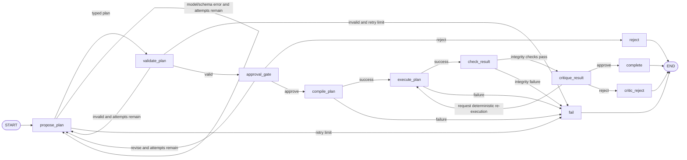

# AHS LangGraph agent workflow

## Boundary

The workflow is an orchestration layer around the existing deterministic AHS services. The LLM-facing adapter has exactly one capability: return a Pydantic `AnalysisPlan` through structured output. It is not given a SQL tool, and neither `AgentWorkflowRequest` nor `AnalysisPlan` accepts arbitrary SQL. Pydantic uses `extra="forbid"`, so a model or caller that supplies a `sql` property is rejected before graph validation.

Deterministic services retain authority for:

- semantic and physical-schema validation;
- universe, weight, recode, filter, and required-variable closure;
- approved join-path enforcement and child preaggregation;
- DuckDB SQL compilation and bound parameters;
- descriptive survey calculations and suppression;
- post-execution fingerprint, SQL, parameter, dataset, join-contract, alias, and inference-boundary checks.

## Graph



## State

`AHSAgentState` is a `TypedDict` with JSON-serializable values so it can be stored by LangGraph checkpointers without pickling application objects. It contains:

- question and user context;
- compact semantic planning context derived from approved catalogs;
- approval mode, maximum plan attempts, and typed result-critic configuration;
- attempt counter, proposed plan, validation issues, and human feedback;
- validated plan, approval decision, compiled request, execution result, integrity report, and result-critic report;
- deterministic result re-execution counter;
- structured workflow error and append-only audit log.

Pydantic models are reconstructed at deterministic node boundaries. This retains validation while keeping checkpoints portable.

## Nodes and conditional edges

1. `propose_plan` invokes `AnalysisPlanModel.propose()` with a `PlanProposalRequest`. The request includes the question, approved semantic context, previous plan, deterministic validation issues, and human feedback. The output must validate as `AnalysisPlan`.
2. `validate_plan` calls `AnalysisPlanService.validate()`. Invalid plans never reach compilation. Validation issues are routed back to the model while the attempt budget remains.
3. `approval_gate` uses LangGraph `interrupt()` by default. The interrupt payload is an `ApprovalRequest` containing the typed plan, fingerprint, and deterministic validation messages. The caller resumes with `ApprovalDecision` (`approved`, `rejected`, or `revise`).
4. `compile_plan` calls `AnalysisPlanService.compile_validated()`.
5. `execute_plan` calls `AnalysisPlanService.execute_validated()`.
6. `check_result` calls `AnalysisResultChecker`, which compares the validated, compiled, and executed artifacts.
7. `critique_result` calls `AnalysisResultCritic`, which compares the released estimates with the validated plan and optional approved reference estimates. Its typed decision is limited to `approve`, `reject`, or `request_reexecution`.
8. A re-execution decision routes back to `execute_plan` without changing the plan, compilation, SQL, parameters, or numeric outputs.
9. `complete`, `reject`, `critic_reject`, and `fail` produce terminal states.

Plan repair is bounded by `max_plan_attempts` (default 3, maximum 10). Result re-execution is independently bounded by `result_critic.max_reexecutions` (default 1, maximum 3).

## Projects invariant

The planning context is generated from the active PUF catalogs and preserves the durable project correction:

- `CONTROL` is the only required PUF project relationship key;
- project row identity is optional and unresolved;
- `PROJECTNO` is not exposed to the planner as a verified PUF planning field;
- household-to-project joins require aggregation to exactly one row per `CONTROL`;
- raw household-to-project joins and mortgage-to-project joins remain prohibited.

## Structured model adapters

`LangChainStructuredPlanModel` accepts any LangChain chat model implementing `with_structured_output` and binds it directly to `AnalysisPlan`. The system instruction prohibits SQL, executable code, and invented project identity fields.

`MockAnalysisPlanModel` accepts a deterministic sequence of plans, dictionaries, exceptions, or callbacks. It records every `PlanProposalRequest`, enabling tests to verify validation feedback and human revision feedback without network calls.

## Approval API

```python
pause = workflow.invoke(
    {
        "question": "Compare housing-quality problems by tenure and structure type.",
        "approval_mode": "interrupt",
        "max_plan_attempts": 3,
    },
    thread_id="ahs-quality-demo",
)

result = workflow.resume(
    "ahs-quality-demo",
    {"decision": "approved"},
)
```

Use a durable production checkpointer rather than the default `InMemorySaver`. The same `thread_id` must be used to resume an interrupted run.

## Result checks

The deterministic checker verifies:

- validated and executed plan fingerprints match;
- compiled and executed request fingerprints match;
- parameterized SQL, display SQL, and bound parameters match;
- datasets and join-contract IDs match;
- at least one estimate is present;
- the output alias matches the plan;
- no standard errors, confidence intervals, p-values, or unsupported inferential claims are emitted.

A failed check routes to the terminal failure node; the LLM cannot override it.

## Logging and audit

Each node emits a standard Python log record and appends a structured `WorkflowEvent` with UTC timestamp, node, event code, attempt number, severity, message, and selected non-sensitive details. The final `AgentWorkflowResult` contains the complete audit log.

## Result critic

`AnalysisResultCritic` is deterministic and non-mutating. It performs the following checks after the lower-level integrity checker succeeds:

- statistic and weighting mode match the validated plan;
- weighted and unweighted denominators are nonnegative;
- percentage numerators do not exceed denominators;
- percentage complements equal denominator minus numerator;
- released estimates agree with deterministic numerator/denominator formulas within the configured decimal tolerance;
- percentages are between 0 and 100;
- result group keys are unique and have exactly the compiled grouping shape;
- expected groups and comparison reference groups are present exactly once;
- configured category selectors are mutually exclusive and all required categories are represented;
- null estimates occur only for suppression or nonpositive denominators;
- explicitly supplied reference estimates match within explicitly supplied absolute or relative tolerances.

Reference estimates are never inferred. Each `ReferenceEstimate` requires a `source_id` and at least one explicit tolerance. If no approved reference is supplied, the reference check is reported as `not_applicable`.

The critic report contains observations and check outcomes for audit, but no replacement-value field. If a retryable check fails and budget remains, the graph reruns the same `ValidatedAnalysisPlan` through `AnalysisPlanService.execute_validated()`. If the issue persists or a nonretryable configuration error is found, the critic rejects the result.
